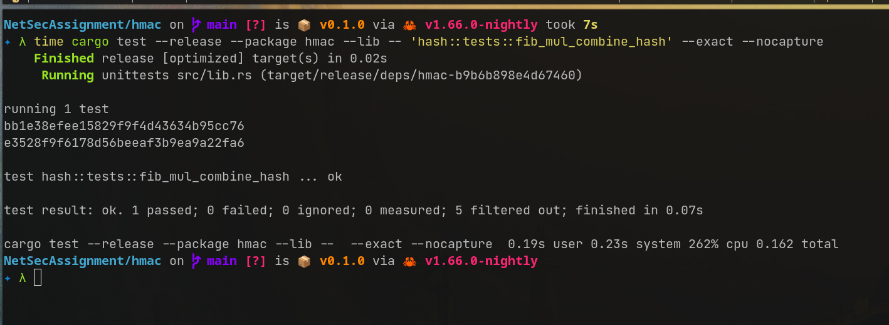
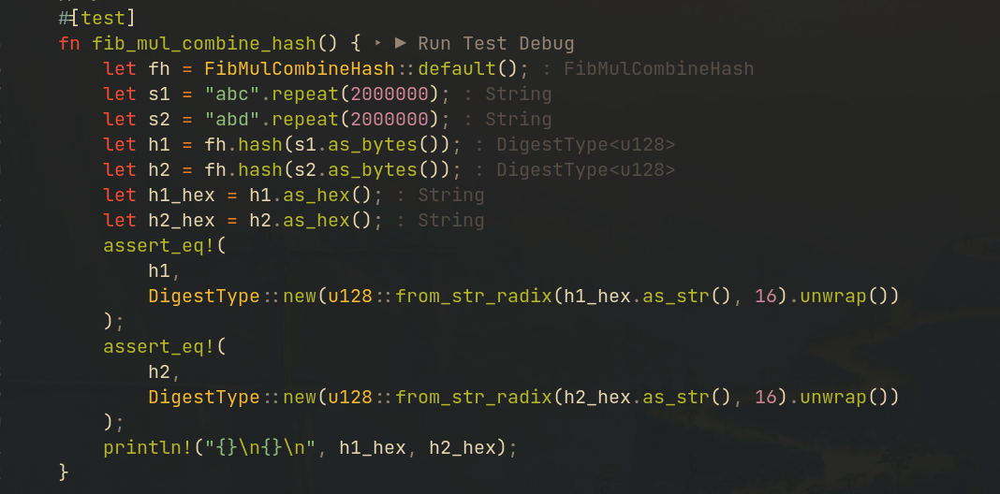
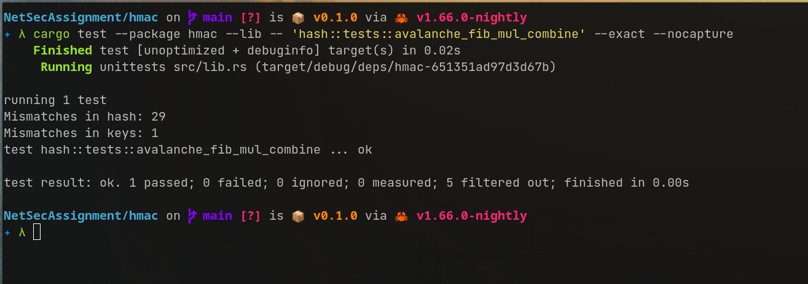
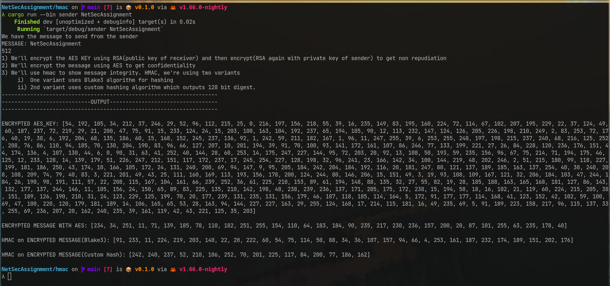
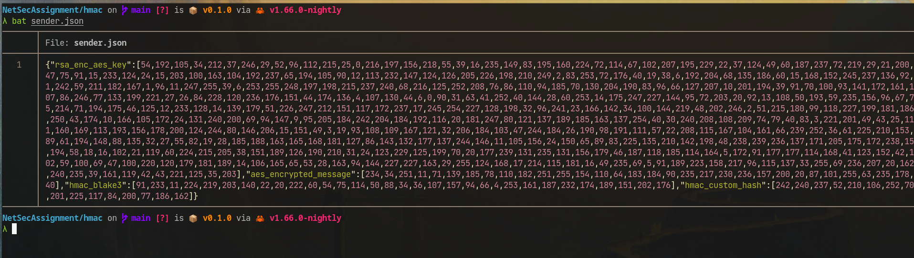
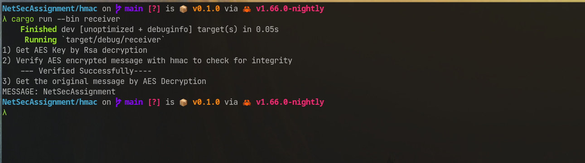

# HMAC

## Problem Statement

Implement HMAC and verify message integrity,confidentiality and non repudiation.
(Recommeneded to use your own unique hashing algorithm)

## Solution

### Approach

We must verify Non Repudiation, Confidentiality and Message Integrity. **HMAC**
can be used to verify the **Message Integrity**. We will have to use other
things in order to get **Non Repudiation** and **Confidentiality**. We are using
Public Key Cryptography(in order to get Non Repudiation) and Private Key
Cryptography(in order to get Confidentiality). Namely we're using **RSA** and
**AES**.

Steps we followed are as follow:

1.  Let the message be `MESSAGE`.
2.  Both the sender and receiver have private key and public key of their own.
    Let the public key `PUB(sender)` and private key be `PRIV(sender)`. Similary
    let the public key of receiver be `PUB(receiver)` and private key of
    receiver be `PRIV(receiver)`.
3.  Let `AESKEY` be key for AES. `AESKEY` is known only to the sender initially.
4.  **Sender** encrypts the `AESKEY` with `PUB(receiver)`. Let the result be
    `enc1`
5.  **Sender** will then encrypt `enc1` with `PRIV(sender)`. Let the result be
    `ENC_AES_KEY`.

```rust
let priv_key = rsa::encrypt_private(&rsa::encrypt_public(AES_KEY));
```

6.  **Sender** will now encrypt `MESSAGE` with `AESKEY`. Let the result be
    `ENC_MSG`.
7.  **Sender** will use hmac to generate the signature for `ENC_MSG`.
8.  In our case, we're using two hashing algorithm for hmac. We're using a well
    known and popular cryptographic hashing algorithm `Blake3` and another one
    made by us which we're naming `FibMulCombineHash`.

### FibMulCombineHash description

-   The code is available in `hmac/src/hash.rs`. There are some tests for it as
    well.

`FibMulCombineHash` is a cryptographic hashing algorithm which outputs 128 bit
digest. The inspiration for this algorithm was taken from the book
[The Art of Computer Programming by Donald Knuth, Volume 3,Section 6.4, page 518](https://www.amazon.in/Art-Computer-Programming-Sorting-Searching/dp/0201896850).
The algorithm is extremely fast, because it's just a multiplication followed by
a shift, in order to bring the output to some [0, 2^k) domain. We don't have the
shift state as we want the domain to be full [0,2^128). The hash function is
known to produce a very uniform distribution of hash values, hence minimizing
collisions.

We hash each input byte with this and combine all of them parallely, which makes
a very good usage of CPU cores. **In order to hash a 2 Mega Byte String, our CPU
usage was well over 200% for this algorithm**. The hash combining strategy is
also just a bunch of shifts and additions which will be very fast. The hash
function has `Avalance Effect` as well, whcih makes it a very hash function.

| More than 200% CPU usage for 2MB string | Code for 200% CPU usage        |
| :-------------------------------------- | :----------------------------- |
|                |  |

| Avalanche Effect         |
| :----------------------- |
|  |

9. We will send **HMAC** value calculated using both of these hash functions to
   the receiver.
10. Sender will then generate a json file called `sender.json` which follows the
    following struct.

```rust
pub struct SenderStruct {
    // stores ENC_AES_KEY
    pub rsa_enc_aes_key: Vec<u8>,
    // stores  ENC_MSG
    pub aes_encrypted_message: Vec<u8>,
    //stores Hmac of ENC_MSG with Blake3
    pub hmac_blake3: Vec<u8>,
    // Stores Hmac of ENC_MSG with FibMulCombineHash
    pub hmac_custom_hash: Vec<u8>,
}
```

11. **Receiver** will read `sender.json` and get the fields from it.
12. **Receiver** will then verify the `HMAC` for both the hash functions. This
    proves **Message Integrity**.
13. **Receiver** will then go on and decrypt the `ENC_AES_KEY` using
    `PRIV(receiver)` and `PUB(sender)`. It will be
    ```rust
    let aes_priv_key =
       rsa::decrypt_private(&rsa::decrypt_public(&sender_params.rsa_enc_aes_key));
    ```
14. This RSA decryption proves **Non Repudiation**,since private key of the
    sender was involved in the AESKEY encryption.
15. Now the encrypted message `ENC_MSG` can be decrypted using the `AESKEY`.
    This proves **Confidentiality**

#### Output

| Sender Output             |
| :------------------------ |
|  |

| Sender Json                |
| :------------------------- |
|  |

| Receiver Output             |
| :-------------------------- |
|  |

# Buffer Overflow

# Illegal Packet

# DOS

# Shrew Attack
